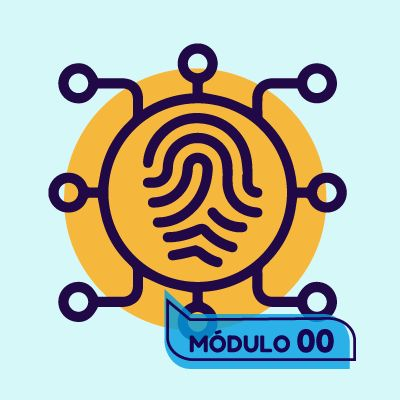
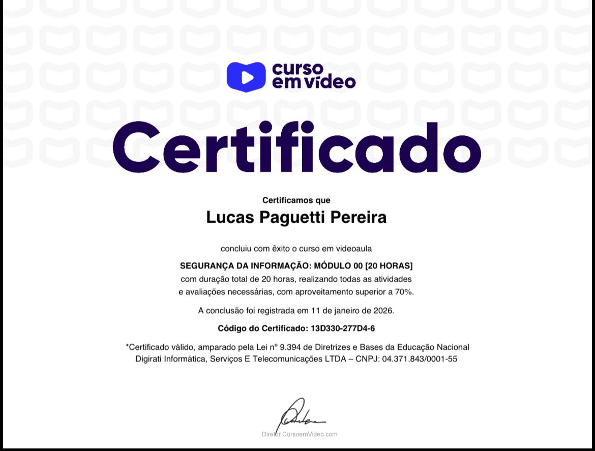

<h1 align="center">
  Segurança da Informação – Curso em Vídeo
   🔐
</h1>

  

  Repositório de estudos baseado no curso de <strong>Segurança da Informação</strong> 
  do <strong>Curso em Vídeo</strong>, ministrado pelo Prof. <strong>Gustavo Guanabara 👨🏻‍🏫</strong>

<h2 align="center">👨🏻‍💻 Autor deste Repositório: </h2>

Lucas Paguetti Pereira 🧙‍♂️  
🏫 Instituição: Cesar School 🎓🧡  
📍 Recife, Pernambuco — <strong>Brazil</strong> 🇧🇷  

 

---

<h2 align="center">🌐 Curso em Vídeo: </h2>

<h2 align="center">🫆💻🔒 Conteúdo dos Módulos: </h2>

### 🟢 Módulo 00 — Introdução à Segurança da Informação
- Apresentação do curso;  
- O que é Segurança da Informação;
- Importância da segurança no dia a dia;  
- Conceitos iniciais e termos básicos; e
- Cuidados básicos com computadores e dispositivos.  

### 🔐 Módulo 01 — Fundamentos da Segurança da Informação
- Confidencialidade, Integridade e Disponibilidade (CID);  
- Ameaças, vulnerabilidades e riscos;  
- Engenharia social;  
- Políticas de segurança; e 
- Boas práticas de segurança da informação. 

### 🌐 Módulo 02 — Segurança em Redes e Internet
- Funcionamento da Internet;  
- Protocolos (HTTP, HTTPS, FTP, DNS); 
- Firewalls; 
- Principais ataques em redes (DoS, MITM, Sniffing); e  
- Segurança em redes Wi-Fi e navegação segura.  

### 💻 Módulo 03 — Segurança em Sistemas e Dispositivos
- Malwares (vírus, worms, trojans, spyware e ransomware);  
- Antivírus e ferramentas de proteção;
- Atualizações e correções de sistemas;  
- Backups e recuperação de dados; e  
- Segurança em dispositivos móveis.  

### 🛡️ Módulo 04 — Criptografia, Privacidade e LGPD
- Conceitos de criptografia;  
- Criptografia simétrica e assimétrica; 
- Certificados digitais; 
- Senhas fortes e autenticação; e 
- Privacidade, LGPD e proteção de dados pessoais.

<h2 align="center">💼 Estrutura do Projeto: </h2>

<pre>
🔒 Segurança da Informação/
├── 📂 Modulo 00 - Introdução/
│   └── 📄 conteudo.txt
│
├── 📂 Modulo 01 - Fundamentos/
│   └── 📄 conteudo.txt
│
├── 📂 Modulo 02 - Redes e Internet/
│   └── 📄 conteudo.txt
│
├── 📂 Modulo 03 - Sistemas e Dispositivos/
│   └── 📄 conteudo.txt
│
├── 📂 Modulo 04 - Criptografia e LGPD/
│   └── 📄 conteudo.txt
│
├── 🖼️ img/
│   ├── cursoemvideo_seguranca.jpeg
│   ├── Segurança_da_inf0_icone.jpeg
│   └── certificado_seguranca.jpeg
│
├── 🔖 README.md
└── 📜 LICENSE (MIT)

</pre>

<h2 align="center">🏆🔐 Objetivo do Repositório: </h2>

Este repositório foi criado **com o objetivo de:**

- 📚 Organizar e documentar os estudos realizados no curso de Segurança da Informação;  
- 🧠 Consolidar conceitos fundamentais sobre proteção de dados, sistemas e redes;  
- 🔐 Desenvolver consciência crítica sobre boas práticas de segurança digital; e 
- 🚀 Servir como material de apoio, consulta futura e portfólio acadêmico/profissional.  

<h2 align="center">📜 Licença: </h2>

Este projeto está licenciado sob a licença **MIT**, o que permite:

- ✅ Uso livre para fins educacionais e profissionais ✅
- ✅ Modificação e adaptação do conteúdo (com forks 🪾) 
- ✅ Compartilhamento e redistribuição 🔄

Desde que seja mantido o aviso de direitos autorais🔍.

Sinta-se à vontade para estudar, reutilizar e compartilhar este material. 💡

<h2 align="center">🏆 Certificados de Segurança da Informação: </h2>

  Registro dos certificados obtidos nos cursos e módulos de <strong>Segurança da Informação</strong>
  realizados no <strong>Curso em Vídeo</strong>.

<h3>🟢 Módulo 00 — Introdução à Segurança da Informação</h3>

  

<a href="img/Segurança_00.jpeg">

